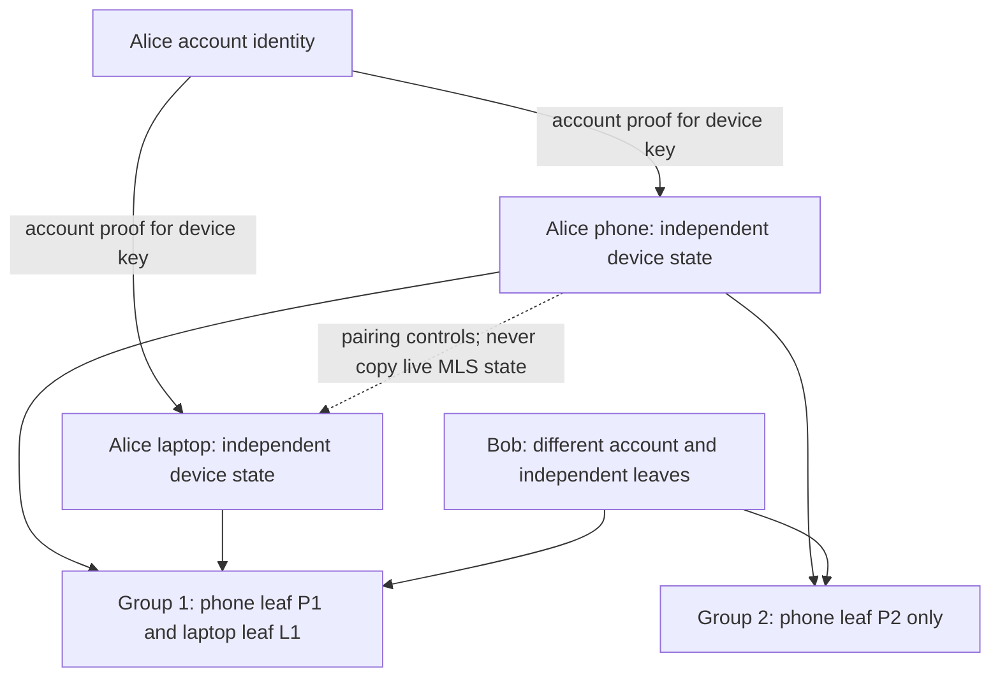
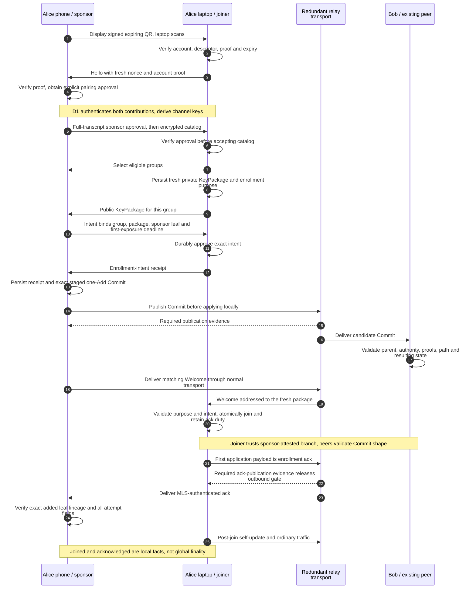
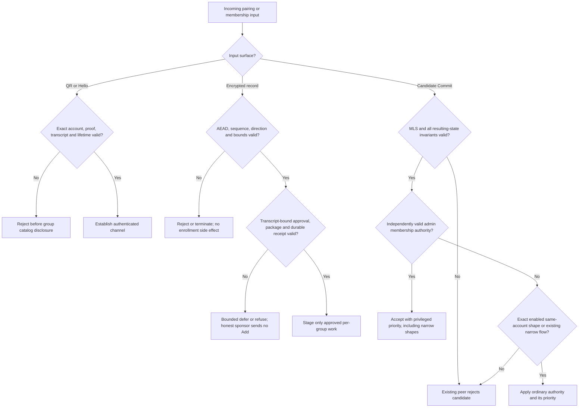
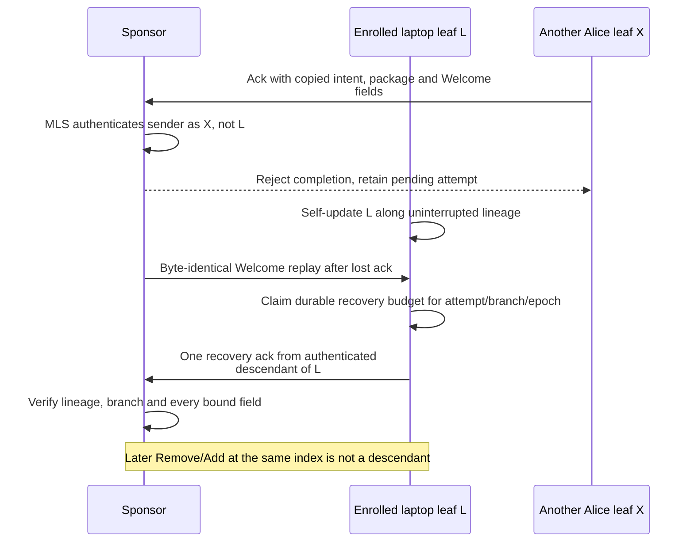
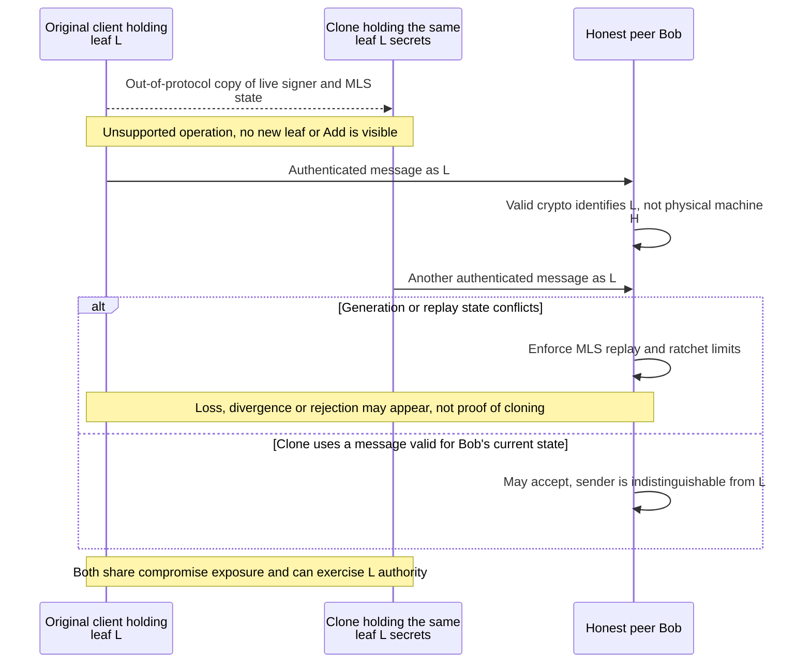
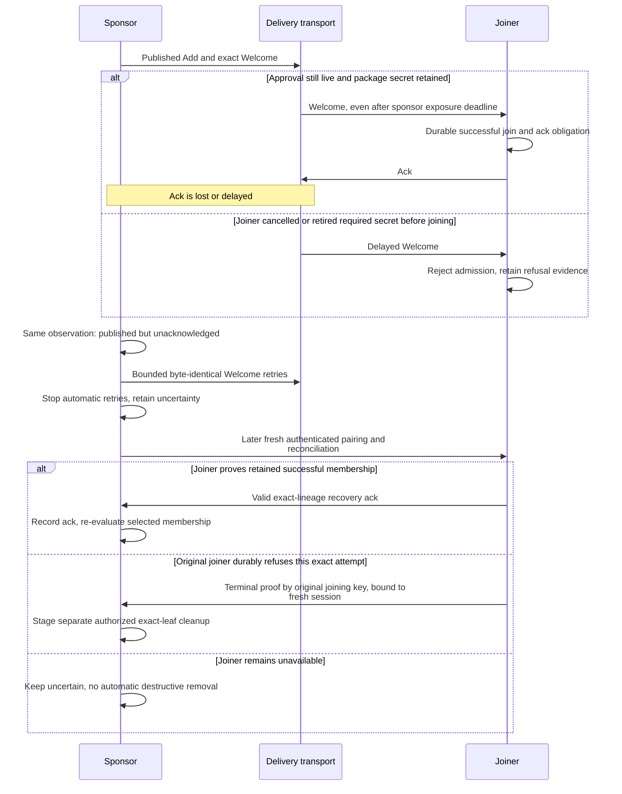
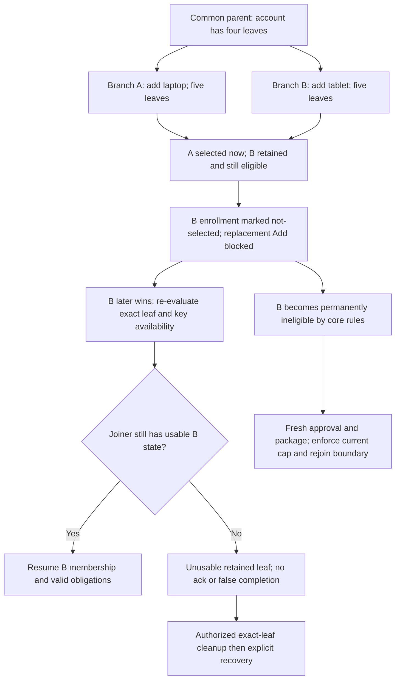
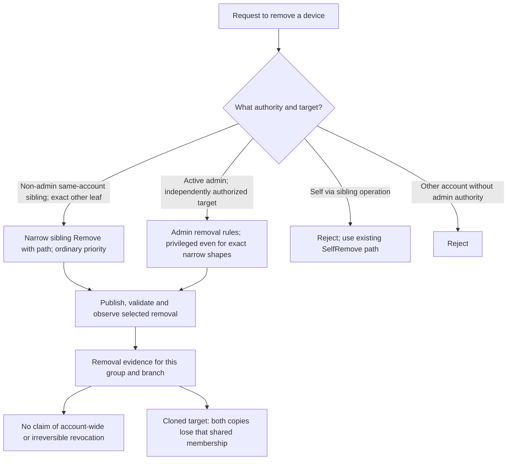

# Client flows, failure paths and security limits

Status: explanatory diagrams for the non-normative [action plan](README.md), 2026-09-25. They illustrate the proposed
amended behavior, not the unamended #417 implementation. The [protocol plan](protocol-plan.md) owns decisions and the
[validation matrix](validation-and-rollout.md) names the tests. Diagram arrows show messages or decisions, not guaranteed
delivery. Every durable boundary is recoverable after restart.

## 1. One account, independent leaves

An account is a Nostr identity. A leaf is one cryptographic membership in one MLS group, not an attestation that a
particular physical phone exists. A local device label is presentation, not authority. The intended architecture gives
each installation independent device signing material and a distinct leaf in every group it joins.

**Tradeoff:** per-group opt-in and independent keys preserve group boundaries, but pairing does not automatically enroll
the laptop in Group 2 or deliver historical Group 1 messages. The five-leaf proposal limits authenticated tree entries,
not the number of physical machines secretly holding a copied entry's keys. See diagram 5.

## 2. Happy path: pair, approve, add, join, acknowledge

Both Alice clients already have access to the same account signer. Alice's phone is already a member of the selected
group. The group has explicitly enabled the feature and every current leaf supports it. Bob represents other group
members who validate the Add; he does not approve Alice's ordinary same-account enrollment manually.

**Tradeoffs:** the receipt adds a round trip but prevents an honest sponsor from publishing before durable joiner
approval. Ack-before-update adds a durable publication dependency but makes initial sender attribution unambiguous.
The joiner waits for the defined publication boundary, not an unobservable acknowledgement-of-ack. Other peers can
temporarily see different branches; neither a relay's acknowledgement nor the enrollment ack certifies finality.

**Coverage:** W04/W07, E01/E06 and B1–B7. D1 determines the final channel construction; this sequence does not freeze it.

## 3. Tampered carrier, wrong identity or unauthorized Add

Different checks belong to different recipients. A carrier cannot authorize enrollment. Existing peers can validate an
Add against its parent; a new joiner checks the approved intent and sponsor-attested resulting branch instead.

Examples: a wrong-account KeyPackage cannot use the sibling exception; a non-admin mixed Add/Remove does not qualify;
an admin may still perform a broader operation permitted by ordinary admin policy; no actor bypasses the enabled cap
or malformed component rejection. D1 must protect package/intent/receipt integrity even if the attacker captures the QR:
under unmodified PSK-only, that attacker can forge AEAD records and substitute an old same-account package whose private
key it holds. Local purpose metadata on the honest joiner does not detect that substitution at the sponsor. Authenticated
DH with both keys and the full transcript bound prevents this QR-only attack; it does not repair account-key compromise.
An attacker can still drop traffic, exhaust a bounded channel budget, or force timeout: confidentiality/authentication do
not guarantee availability.

**Sponsor trust limit:** an already authorized malicious sponsor can violate its own UI's consent ceremony or present
a sponsor-attested isolated branch. Other members reject invalid candidate-parent operations, but the joiner cannot
reconstruct all those checks from a Welcome. Receipts prove protocol facts to honest implementations; they do not
provide hardware attestation or make a compromised client honor human approval. Pairing both requires account authority
and trusts a current sponsor; the UI must not claim universal human-consent enforcement.

**Coverage:** W03–W08, U01–U10, C05/C07. Keep this distinction in the threat model and security review.

## 4. A different sibling tries to acknowledge someone else's enrollment

Sharing an account does not authorize a different leaf to complete a specific enrollment. This rule needs real MLS
sender provenance, not the account pubkey or a leaf number supplied inside the message.

**Tradeoff:** keeping branch-relative lineage and ack budgets costs storage and replay work. Comparing account IDs cannot
enforce this rule. Repeated identical Welcomes coalesce with pending work and cannot trigger another recovery ack in the
same attempt/branch/epoch, including after restart. Exact-byte retries remain finite; lost acks can still leave uncertainty.
A client holding an actual clone of L's secrets is a different problem: see diagram 5.

**Coverage:** A04–A07, E04/E12; M3 implements engine-side validation or durable authenticated provenance.

## 5. Two clients share one leaf's private state

Copying an account secret to another supported signer is not itself copying an MLS leaf. The prohibited operation here
is copying the device's MLS signer, tree/epoch state and sender ratchets so two installations act as the same membership.
Reusing a signature key in a proposed *new* Add can be rejected by uniqueness checks. Secretly cloning an *existing* leaf
does not produce an Add for peers to inspect.

**What can be enforced:** MDK must refuse supported import/archive paths that resume a copied live device state, generate
fresh device keys on new installation, enforce local single-writer/file-lock discipline, reject duplicate new-leaf keys,
and preserve ordinary replay/ratchet limits. Local locks cannot stop a copied database on another machine. The protocol
cannot generally prove that two authenticated messages came from two physical devices when the credentials are identical.
An ack from the cloned enrolled leaf can authenticate as that leaf; the exact-leaf check only excludes *different* leaves.

**Cryptographic caveat:** MLS derives message keys from a sender's generation and includes a random four-byte reuse guard.
State cloning/rewind can repeat generations and break independent ratchet ownership; it is inaccurate to claim every
pair of cloned sends necessarily repeats the exact AEAD nonce. Random guards mitigate accidental nonce reuse, not shared
leaf impersonation or a coordinated clone. See [RFC 9420 section 6.3.1][rfc-encryption] and
[OpenMLS forward-secrecy guidance][openmls-fs].

**Recovery tradeoff:** once suspected, stop treating the shared leaf as a safely independent device. A healthy separate
sibling or authorized admin removes the shared leaf, which removes the membership used by *both* copies on the selected
branch. Enroll clean replacements with fresh device keys and new leaves. Do not promise selective removal of only one
clone, or that a self-update proves the clone gone. If no healthy authority remains, use explicit admin recovery where
available; otherwise v1 has no in-band recovery. Compromised account-signing authority needs separate account-wide work.

**Required new cases:** X01–X04 in validation. Test the limitation honestly: acceptance of a valid cloned sender is an
expected trust-boundary result, not a test that invents clone detection.

## 6. Lost acknowledgement versus cancelled first admission

The sponsor's observation is identical in both cases: it has an exposed Add and no valid ack. The safe next action is
therefore the same until authenticated reconciliation supplies more evidence.

**Tradeoff:** conservative uncertainty may occupy a leaf slot and require user/admin recovery. Automatically deleting on
timeout would sometimes evict a successfully joined offline device. The deadline limits first sponsor exposure; delayed
delivery alone does not force refusal while approval and private material remain live. Cancelling after receipt can
still strand a leaf because publication may already have happened; warn before cancellation. Refusal races are serialized
against first join; cleanup is a new Commit, not rollback of history. A successfully joined client leaves through the
existing authorized departure flow, including SelfRemove's admin prerequisites, rather than proving never-joined refusal.
Welcome retries stop when required catch-up material is unavailable or the retry budget ends; that is not proof of failure.

Account authentication alone is not proof this is the original joiner. If full state loss destroyed the original joining
signer, retain uncertainty; the user may request a separately authorized leaf removal without claiming proven failure.

**Coverage:** E07–E11, E13/E15, B4/B5/B8. Reconciliation wire details are a P4/G1 deliverable, not assumed existing messages.

## 7. Concurrent enrollments and branch revival

Two valid Adds from the same parent create alternatives, not a merged set of new leaves. Selection can change while a
losing branch remains inside the core rollback horizon. The plan intentionally chooses conservative retry availability.

**Tradeoffs:** neither branch initially exceeds five, so rejecting the losing Welcome solely on leaf count is wrong.
Holding retry until permanent ineligibility can delay progress indefinitely in a quiet group. Local retirement does not
shorten the core horizon. The product reports retry-blocked or offers explicitly authorized reconciliation/removal; it
does not fabricate finality, merge branches, or race a replacement Add merely to make progress look complete.

**Coverage:** U07 and R01–R05. On actual selection, validate each candidate against its own parent and resulting state.

## 8. Removal authority and its limits

**Tradeoffs:** reciprocal sibling removal makes normal device management possible without waiting for an admin, but a
compromised current sibling can also remove healthy siblings. Admin membership authority keeps its priority without
padding the Commit. Because admin authority belongs to the account, a compromised sibling of an admin account has the
same priority; this change does not promise the healthy device wins. Authorization does not prove benign intent. Retained
competing branches can undermine apparent permanence under existing convergence. A device label, public publication
slot, or successful removal in one group is not global identity revocation. Keep those limitations visible in the UI.

**Coverage:** A01–A03, I06, X04 and R01–R05. Witnesses remain account-deduplicated even when an account has several leaves.

## Edge-case tradeoff summary

| Choice | Benefit | Cost / limit | User-visible consequence |
| --- | --- | --- | --- |
| Independent leaves | Distinct device authority and cryptographic state | More group leaves, updates and recovery work | Explicit per-group enrollment and removal |
| Exact-leaf ack | Different sibling cannot forge enrollment completion | Retained lineage and branch provenance | Joined, acked and currently selected may differ |
| No timeout deletion | Avoids evicting a joined offline device | Uncertain attempts can occupy slots | Reconcile or request authorized cleanup |
| Wait for permanent branch ineligibility | Avoids replacement enrollment colliding with revival | Quiet groups can remain retry-blocked | Honest blocked status; no finality timer |
| Authenticated DH recommended by D1 | QR capture alone cannot derive channel keys or substitute an offered package | Platform/transcript review; compromised accounts/endpoints remain trusted | Unmodified PSK-only cannot ship: active QR capture permits forged controls and package substitution; later recovery reveals recorded metadata |
| Five-leaf provisional cap | Predictable bound on current tree entries/account | Restricts legitimate fleets; does not count hidden clones | Explicit cap error and remove-before-add flow |
| One-device first invitation | Avoids unauthenticated slot fanout | Selected installation may be unreachable | Risk notice; explicit reinvite recovery |
| LAN carrier | Direct rendezvous without a dedicated relay channel | Permissions, reachability and scoped destination-policy work | Supported-platform declaration and permission errors |
| Sponsor-attested Welcome | Standard assisted MLS join | Joiner cannot prove global branch agreement or all parent rules | Do not equate local join with global finality |
| No clone detector claim | Honest statement of cryptographic identity | Copied credentials can impersonate one leaf | Refuse supported cloning; remove shared leaf and re-enroll clean devices |

[rfc-encryption]: https://www.rfc-editor.org/rfc/rfc9420.html#section-6.3.1
[openmls-fs]: https://book.openmls.tech/forward_secrecy.html
